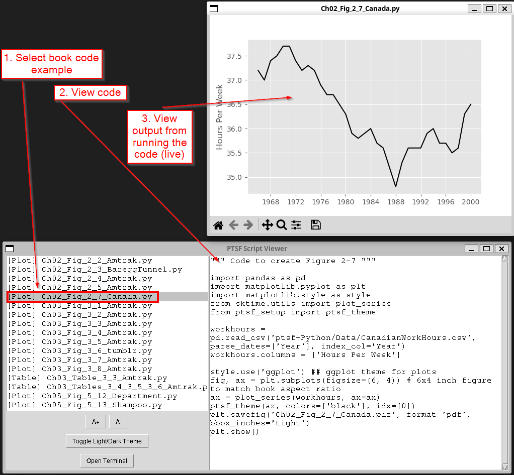

# 🛠️ Setting Up Your Environment for Python Code Examples

These notes support running the examples from the book **Practical Time Series Forecasting with Python (PTSF)**. Throughout this document, “PTSF” refers to the title of this book.

You can set up the environment using either:

- **Docker Image (recommended)** — fast, preconfigured
- **Local Installation** — manual setup with pip or conda

---

## 🐳 Method 1: Using Docker (Prebuilt Image)

This method uses a prebuilt image named `ptsf-image` published on Docker Hub.

### Initial Setup

If you have not yet installed Docker on your computer, follow these instructions:

- **Windows / Mac:** (including Windows/WSL) Download and install Docker Desktop from [https://www.docker.com/products/docker-desktop](https://www.docker.com/products/docker-desktop)
- **Linux (Ubuntu/Debian):**
  > If you are running Ubuntu on Windows/WSL, follow the instructions for Windows/Mac instead.
  ```bash
  sudo apt update
  sudo apt install docker.io -y
  sudo systemctl enable docker
  sudo systemctl start docker
  ```
  Optionally, add your user to the `docker` group to avoid using `sudo`:
  ```bash
  sudo usermod -aG docker $USER
  newgrp docker
  ```

Once Docker is installed, pull the PTSF Docker image from Docker Hub:

```bash
docker pull dockeruserejb/ptsf-image
```

This will download the latest environment used to run examples from the book.

## Linux: Running a Docker Container

The downloaded ptsf-image contains an important utility to easily see the code examples in the book. In this section, 
we create a script `run_ptsf.sh` to run a docker container. The container wakes up with the code viewer running. (see Figure 1.) You can also use the code viewer to bring up a terminal with the Python environment activated and ready to use.

### Linux: `run_ptsf.sh`

Create a shell script named `run_ptsf.sh` with the following contents:

```bash
#!/bin/bash

IMAGE_NAME="dockeruserejb/ptsf-image"
HOST_FOLDER="$1"
MOUNT_OPTION=""

if [ -n "$HOST_FOLDER" ]; then
  if [ ! -d "$HOST_FOLDER" ]; then
    echo "❌ Error: Folder '$HOST_FOLDER' does not exist on host."
    exit 1
  fi
  MOUNT_OPTION="-v $HOST_FOLDER:/tmp/tmp_ptsf"
  echo "📁 Mounting host folder '$HOST_FOLDER' to container path '/tmp/tmp_ptsf'"
fi

docker run --rm -it \
  -e DISPLAY=$DISPLAY \
  -e WAYLAND_DISPLAY=$WAYLAND_DISPLAY \
  -e XDG_RUNTIME_DIR=$XDG_RUNTIME_DIR \
  -e MPLBACKEND=TkAgg \
  -v /tmp/.X11-unix:/tmp/.X11-unix \
  -v /mnt/wslg:/mnt/wslg \
  -v $XDG_RUNTIME_DIR:$XDG_RUNTIME_DIR \
  $MOUNT_OPTION \
  $IMAGE_NAME
```

You can run this script in one of two ways:  
- with **no arguments**, or  
- with **one argument**: a folder on your machine (e.g., `my_ptsf`)

If a folder is provided, you’ll be able to access its contents inside the Docker container at `/tmp/tmp_ptsf`, e.g.,

```bash
cd /tmp/tmp_ptsf
```


#### Figure 1: Code viewer running in the Docker container


## Windows: Running a Docker Container

The downloaded ptsf-image contains an important utility to easily see the code examples in the book. In this section, 
we create a PowerShell script `run_ptsf.ps1` to run a docker container. The container wakes up with the code
viewer running. (see Figure 1.) You can also use the code viewer to bring up a terminal with the Python
environment activated and ready to use.


### Windows: `run_ptsf.ps1`

Create a PowerShell script named `run_ptsf.ps1` with the following contents:

```powershell
param (
    [string]$hostFolder = ""
)

# Image to run
$dockerImage = "dockeruserejb/ptsf-image"

# Mount logic
$mountOption = ""
if ($hostFolder -ne "") {
    if (!(Test-Path -Path $hostFolder)) {
        Write-Host "❌ Error: Folder '$hostFolder' does not exist."
        exit 1
    }

    $hostFolderUnix = $hostFolder -replace '\\', '/'
    $mountOption = "-v ${hostFolderUnix}:/tmp/tmp_ptsf"
    Write-Host "📁 Mounting host folder '$hostFolderUnix' to '/tmp/tmp_ptsf'"
}

# X11 for Docker on Windows (assumes XLaunch is running)
$display = "host.docker.internal:0.0"

# Run Docker container
$command = "docker run --rm -it " +
           "-e DISPLAY=$display " +
           "-e MPLBACKEND=TkAgg " +
           "-v /tmp/.X11-unix:/tmp/.X11-unix " +
           "$mountOption " +
           "$dockerImage"

Write-Host "`n🔧 Running:"
Write-Host $command "`n"

Invoke-Expression $command
```

---

## Method 2: Local Installation (pip or conda)

This method assumes you have **R installed on your system**. Please ensure R is installed before proceeding. You can refer to the Windows instructions below for guidance.

Choose the path that matches your platform and preferred package manager.

### **(A) Using pip (Any OS)**

```bash
# 1. Install custom sktime
pip install git+https://github.com/ericjb/sktime.git@ptsf

# 2. Install plotting libraries
pip install matplotlib seaborn

# 3. Install enhanced statsmodels
pip install git+https://github.com/statsmodels/statsmodels.git@main

# 4. (Optional) For ARIMA models
# Requires R installed separately
pip install rpy2

# 5. (Optional) ML tools for Ch. 8-9
pip install tensorflow scikeras
```

---

### **(B) Using conda on Linux**

```bash
# 1. Create and activate environment
conda create -n ptsf-env2 python=3.10 -y
conda activate ptsf-env2

# 2. Base packages
pip install Cython numpy pandas scipy patsy

# 3. Install R and rpy2
conda install -c conda-forge r-base -y
pip install rpy2==3.6.1

# 4. Install R libraries
conda install -c conda-forge r-tidyverse r-fpp3 r-urca -y
conda install -c conda-forge \
  r-fable r-fabletools r-feasts r-tsibble r-tsibbledata r-tibble \
  r-dplyr r-lubridate r-ggplot2 r-stringr r-readr r-readxl r-tidyr \
  r-distributional r-patchwork r-scales r-anytime 'r-timechange>=0.3.0'

# 5. Fix C++ ABI for R
conda install -c conda-forge libstdcxx-ng=15.1.0 -y

# 6. Custom sktime and statsmodels
pip install git+https://github.com/ericjb/sktime.git@ptsf
conda install -c conda-forge matplotlib seaborn -y

# 7. Build statsmodels from source
cd /your/working/dir
git clone https://github.com/statsmodels/statsmodels.git
cd statsmodels
git checkout main
pip install setuptools_scm
rm -rf build dist *.egg-info statsmodels/_version.py
pip install --no-build-isolation .

# 8. (Optional) ML tools
pip install tensorflow scikeras
```

---

### **(C) Using conda on Windows**

1. **Install R**
   - Base R: [https://cran.r-project.org/bin/windows/base/](https://cran.r-project.org/bin/windows/base/)
   - RTools: [https://cran.r-project.org/bin/windows/Rtools/](https://cran.r-project.org/bin/windows/Rtools/)

2. **Update environment variables**

```powershell
# Add to User PATH
[Environment]::SetEnvironmentVariable("PATH", "C:\\rtools45\\mingw64\\bin;C:\\rtools45\\usr\\bin;" + [Environment]::GetEnvironmentVariable("PATH", "User"), "User")

# Set R_HOME
[Environment]::SetEnvironmentVariable("R_HOME", "C:\\Program Files\\R\\R-4.5.1", "User")
```

3. **Install R packages inside R**

```R
install.packages(c("tidyverse", "fpp3", "urca", "fable", "fabletools",
                 "feasts", "tsibble", "tsibbledata", "tibble", "dplyr",
                 "lubridate", "ggplot2", "stringr", "readr", "readxl",
                 "tidyr", "distributional", "patchwork", "scales", "anytime",
                 "timechange"))
```

4. **Set up environment**

```powershell
conda create -n ptsf-env3 python=3.10 -y
conda activate ptsf-env3
pip install Cython numpy pandas scipy patsy rpy2==3.6.1
pip install git+https://github.com/ericjb/sktime.git@ptsf
conda install -c conda-forge matplotlib seaborn -y
pip install tensorflow scikeras

# Build statsmodels from source
$envRoot = $env:CONDA_PREFIX
$srcDir = Join-Path $envRoot "_src"
New-Item -ItemType Directory -Force -Path $srcDir | Out-Null
Set-Location $srcDir
git clone https://github.com/statsmodels/statsmodels.git
Set-Location statsmodels
git checkout main
pip uninstall statsmodels -y
pip install setuptools_scm
Remove-Item -Recurse -Force build, dist, *.egg-info
Remove-Item .\statsmodels\_version.py -Force
pip install --no-build-isolation .
```


For any issues, see the troubleshooting section on the book’s website or post a question via the contact page.

